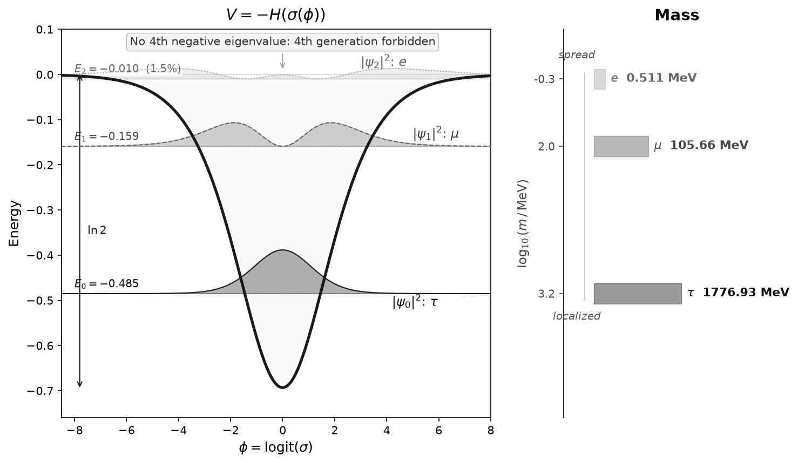

---
navigation:
  order: 30
---

# 3. シュレーディンガー方程式の導出と N = d = 3

V = −H はポテンシャルであり、それだけでは、離散状態が何個あるのかをまだ言わない。本章ではまず、ポテンシャルと同じ指数型分布族の構造から、固有値方程式——シュレーディンガー方程式——を導出する（§3.1）。これでスペクトルの問い——井戸は何個の束縛状態を持つか——が厳密に問える形になり、その答えが N = 3 である（§3.2–3.3）。§3.3 の終わりで、この3つの束縛状態をフェルミオンの3世代と同定する——本章で置く物理的同定はこの一つである。この同定の下で初めて、第二の問いが立つ：束縛状態が表す粒子は現実の空間の中に存在するのだから、その空間の次元は何が決めるのか。実現の整合性がこれに答え、d = 3 が従う（§3.4）。d = 3 の導出は N = 3 の値を使わない——2つの導出が共有するのは作用素だけである。一致 N = d = 3 が §4 の入力になる。
## 3.1. シュレーディンガー方程式の導出

固有値方程式を書くには、§2.3 のポテンシャルに加えて運動項が要る。運動項もまた、ポテンシャルと同じ構造から従う。力学は、§2 の正準集団を逐次の転送として読むことで入る：1刻みごとに、変位の二次変分（運動項）と V = −H（作用重み）を指数の肩に乗せて転送する作用素の族であり、その連続極限が本節末の固有値方程式を与える^II^。残る決定は2つ——運動を載せる座標と、無次元の規格化1つである。いずれも一意に固定される。一意性は証明される^II^。

まず座標である。二値変数の指数型分布族には自然な座標が2つある：

$$u = 2\arcsin\sqrt{\sigma}\quad(\text{Fisher 計量が平坦}),\qquad \phi = \mathrm{logit}(\sigma)\quad(\text{指数の肩の正準パラメータ})$$

両者を分けるのは A3 である。u は禁止点 σ = 0 を有限の端点 u = 0 に置くため、u 上の力学は、まさに非存在の点における境界データを必要とする——非存在が、模型を定義するデータの置き場になってしまう。φ は σ = 0 を無限遠 φ → −∞ に送る：非存在には何の境界データも付かず、A3 の下では何も付けてはならない。許容される座標の中で、A1 の傾斜作用（傾斜重み e^{nφ}、§2.2）が線形になる座標が φ であり——アフィン変換を除いて一意——その目盛りは二値指示子 n ∈ {0,1} が固定する。したがって φ 上の自由運動は定数係数の二次ラグランジアンを持つ。位置依存の係数は変位一様性が排除する^II^。

次に規格化である。運動項の係数を a²/2、作用重みを b と書くと、見かけ2パラメータの族はただ1つの無次元比に縮む：

$$\frac{a^2}{2}\Bigl(\frac{d}{d\phi}\Bigr)^{\!2},\quad b\,V \qquad\longrightarrow\qquad g = \frac{b}{a^2}$$

理由は、A1 の二値指示子 n ∈ {0,1} が φ の単位を、Legendre 恒等式が V = −H の単位を固定し、転送の刻み幅の取り替えは a² と b を同率で動かすからである。1刻みあたりの二次変分と作用重みを同一の転送過程の量として測ることが g = 1 を定める。Landauer のビット規格化（1ビットの情報消去に対応する最小仕事を単位に取る規格化）も独立に同じ値を与える。両固定の一意性は証明される^II^。

後述の §3.3 で確立する束縛状態数は、この最後の選択に依存しない：族 −½ d²/dφ² − g H(σ(φ)) の g ∈ [0.80, 1.50] の全域で同じである。負固有値の個数は g について単調非減少であり（H(σ) ≥ 0 ゆえ、g を上げると二次形式が一様に下がる）、両端 g = 4/5 と g = 3/2 での計数 3 は、付属の証明書コードが区間演算で認証する。したがって区間の全域で N = 3 が従う。付属のコードはさらに、計数が箱サイズ L = 60/100/160 で数値的にも安定であることを確認する。

一方、ε に依存する §5–§8 の補正は g = 1 に依拠する——ε = N − √g·n_WKB(1) が同じ窓の中で符号ごと変わる（g = 0.80 で +0.51、g = 1.50 で −0.41）からである。窓の下端では作用カウント 2.49 が Maslov 閾値 2.5 を下回るが、厳密な状態数は変わらない——§3.2 の閾値規則が目安にすぎないことの実例である。

V = −H をポテンシャル、正準規格化（g = 1）の運動項と組み合わせると：

$$\left[-\frac{1}{2}\frac{d^2}{d\phi^2} - H(\sigma(\phi))\right]\Psi = E\,\Psi$$

これはシュレーディンガー方程式にほかならない——存在の3公理と、上の正準規格化 g = 1 のみを入力として、量子力学の固有値方程式が、正準作用の転送行列の連続極限として現れる。

この章の冒頭で立てた問い——この井戸は何個の離散状態を持つか——は、これで初めて厳密に問える形になり、§3.2–3.3 がそれに答える。その数が何であれ、それは上で一意に固定した座標 φ と平坦な運動項というこの構成の帰結である。平坦な運動項を別の座標で書けば異なる作用素・異なるスペクトルになるため、φ の一意性が本質的である。

ここまでの導出チェーンを要約する：

$$A1\text{--}A3 \;\Rightarrow\; n^2 = n,\; 0<\sigma<1 \;\Rightarrow\; Z = 1+e^{\varphi} \;\xrightarrow{\text{Legendre}}\; V = -H \;\xrightarrow{\text{転送行列}}\; \left[-\tfrac{1}{2}\partial_\phi^2 + V\right]\Psi = E\Psi$$

## 3.2. 3つの束縛状態

なぜフェルミオンはちょうど3世代なのか——なぜ τ, μ, e であり、4つ目はないのか。以下の2小節で、V = −H の井戸がちょうど3つの束縛状態を持ち、4つ目は存在しないことを厳密に証明し（以下 N = 3 と書く）、これをフェルミオンの3世代と同定する。この同定は、§7–§8 の質量比・混合角の一致が裏付ける。

V = −H のポテンシャルは井戸型をしている。中心（φ = 0）で最も深く V = −ln 2、両端 φ → ±∞ でゼロに戻る。量子力学では、こうした井戸が離散的なエネルギー準位を閉じ込める——水素原子が電子を離散的な軌道に閉じ込めるのと同じ原理である。一般に、井戸に何個の準位が入るかは、井戸の深さと幅という2つの自由なパラメータで決まる——深く広い井戸には多くの準位が、浅く狭い井戸には少ない準位しか入らない。

しかし V = −H の井戸には、そうした自由なパラメータが存在しない。深さはShannonエントロピーの関数形そのものから ln 2 ≈ 0.693 という数として一意に決まり（§2.3）、幅にあたる運動項の係数も g = 1 という一意な値に固定されている（§3.1の一意性定理）。ふつうの井戸問題であれば深さと幅は自由に選べるが、この井戸ではどちらも選べる余地がなく、数式の形だけで完全に決まっている。

では、この一意に固定された井戸には何個の準位が入るのか——それを見積もるには、実際に解いて数えるしかない。

*図 1. ポテンシャル V = −H(σ(φ)) とその3つの束縛状態の確率密度 |ψ_n|²（左）。局在した状態ほど重い粒子に対応する（右）。第4の負固有値は存在しない：第4の逐次カイラル世代は存在しない、という予測を与える。*

この井戸に閉じ込められる準位の数を N とする。井戸の中に何個の半波長が収まるかを半古典近似（WKB）で見積もる。整数個が収まるごとに1つの束縛状態が存在する：

$$n_\mathrm{WKB} = \frac{1}{\pi}\int_{-\infty}^{\infty}\sqrt{2H(\sigma(\phi))}\,d\phi = 2.781$$

Maslov 補正を含む標準規約では、第 k 状態の閾値は n_WKB > k − 1/2 である。n_WKB = 2.781 は第3状態の閾値 2.5 を 0.281 上回る一方、第4状態の閾値 3.5 には 0.719 足りない。したがって WKB は N = 3 を示唆する。厳密な状態数とこの半古典的作用カウントの差を ε ≡ N − n_WKB = 3 − 2.781 = 0.219 と定義する[^epsenc]。ε > 0 は、第3状態がぎりぎり束縛されていることを表す[^epsconv]。この ε が本論文の全補正指数の源であり、§5 と §8 で導く結合定数と混合角の NLO 補正を支配する。
[^epsenc]: 厳密な区間包含 0.219188 は付属の証明書コード（Arb 球演算による厳密積分と解析的テール上界）で認証する。認証区間は Paper II の認証区間の内側にある。

[^epsconv]: 同じ限界性を Maslov 補正込みの閾値で測れば 2.781 − 2.5 = 0.281 になる。ε を用いるのは、それが定義に曖昧さのない2つの量——厳密な状態数と作用積分——の比較だからである。閾値規則は漸近的な目安であり、有限の深さでは破れうることを §3.1 の g = 0.80 の例が示している。

この数え上げに調整できるものは何もない。構成の3つの要素はそれぞれ一意である：座標と規格化は §3.1 の一意なそれであり、Shannon エントロピーは強加法性（連鎖則）を含む Khinchin の公理系を満たす唯一のエントロピーである（Khinchin の定理 [16, 17]）。この構成のもとで、N = 3 は区間演算により厳密に証明される（§3.3）。

## 3.3. 厳密証明

**定理（N = 3）。** §3.1 のシュレーディンガー方程式はちょうど3つの束縛状態を持ち、その固有値は区間演算により厳密に包含されている：

$$\begin{aligned}
E_0 &= -0.4850022531029642374452777658 \pm 10^{-24},\\
E_1 &= -0.1590522216188561779934190 \pm 10^{-24},\\
E_2 &= -0.010423393062109459327616 \pm 10^{-22}
\end{aligned}$$

第4の負固有値は存在せず、本質スペクトルは 0 から始まる（有限グリッドの小さな正値は箱の離散化産物）。

*証明（計算機支援・区間演算）。* 証明は独立な3層からなる。

*計数。* パリティにより半直線 [0,∞) 上の Neumann 問題（偶）と Dirichlet 問題（奇）に分解する。ポテンシャルの単調性に基づく区間包含の下で Prüfer 角を区間伝播し、解析的テール評価と組み合わせて、試験エネルギーでの Prüfer 角の厳密な上下界を得る。Sturm 振動理論により、負固有値の個数は角の回転量で厳密に数えられる：偶セクターに2個、奇セクターに1個——N = 3。

*包含。* 上の固有値区間は、区間係数の検証済み高階 Taylor 積分器による両側シューティングで認証される。

*独立検証。* 独立実装（Arb 球演算）が N = 3 を再認証し、sech 型（Pöschl–Teller 型 [18]）試行関数3本の Rayleigh 商による変分上界が3つの負固有値の存在を追認する。証明書コード3本を付属資料に収める。□

**世代との同定。** ここで、この3つの束縛状態 ψ₀, ψ₁, ψ₂ を、フェルミオンの3世代の数学的構造だと仮定する。すると、どの状態がどの世代かは順序が定める：束縛エネルギーが局在度を順序づけ（|E₀| > |E₁| > |E₂|、最も局在したものから）、世代の側には質量階層がある——最も局在した ψ₀ が最も重い世代である。荷電レプトンでは ψ₀, ψ₁, ψ₂ ↔ τ, μ, e。

この段階では同定は仮のものである。§7–§8 でこの同定から質量比と混合角が導かれ、実測値と一致する——その一致が同定を確からしくする。同定が正しければ、第4の負固有値の不在は、第4の逐次カイラル世代が存在しないことの予測である。

## 3.4. 3つの空間次元

前小節までで N = 3 が証明された。この証明は内部空間（φ 座標）の上のものであり、φ は空間座標ではない——§9.2 で示すとおり、内部と時空は独立な因子である。一方、§3.3 の仮の同定の下では、3つの束縛状態が表すフェルミオンは、現実の空間の中に存在する粒子である。それでは、その空間の次元は何が決めるのか。答えは実現の整合性である：内部の井戸は、空間の中の粒子の上で壊れずに実現されていなければならない。本小節では、この整合性の2条件——井戸の保存（動径方向に移しても作用素が変形しないこと、A3 による基準：d = 1, 3 のみ）と重力伝播（d ≥ 3）——の共通解として、空間次元が d = 3 に一意に定まることを示す。

V = −H と同じ井戸型を d 次元空間の動径プロファイルとして考える。ここで σ(r) は σ(φ)（φ ∈ ℝ）と同じ井戸型を動径変数 r ≥ 0 に移したものである——定義域の違いは後述の全直線量子化との比較で扱う。d 次元シュレーディンガー方程式を標準的な偏波分解により1次元の動径方程式に帰着させると、角運動量零（球対称）の動径チャネルに追加の有効力 (d−1)(d−3)/(8r²) が現れる：

$$V_\mathrm{eff}(r) = -H(\sigma(r)) + \frac{(d-1)(d-3)}{8r^2}.$$

分子 (d−1)(d−3) は d = 1 と d = 3 でゼロになり、V = −H がそのまま残る。その他の次元では、この幾何学的項が作用素を変形する：

| d | (d-1)(d-3)/8 | 作用素への影響 |
|---|---|---|
| 1 | 0 | 変形なし |
| 2 | -1/8 | 引力的な項が加わる（余分な状態を生む向き） |
| 3 | **0** | **変形なし：井戸の形が保存** |
| 4 | +3/8 | 斥力的な項が加わる（限界的な第3状態を失う向き） |
| ≥5 | ≥1 | 強い斥力 |

全直線量子化（φ ∈ ℝ）は端点で本質的自己共役であり境界条件を要しない。A3（非存在は状態ではない——境界での追加データの禁止。§3.1 の u 型座標の排除と同じ帰結）^II^の下では、この全直線上の正準量子化を基準とし、空間的実現には正準作用素へ余分な逆二乗項を加えないことを要求する。この要求を満たすのは係数 (d−1)(d−3)/8 が消える d = 1, 3 のみである。なお、逆二乗項が零でも全直線問題と動径問題が同一になるわけではない——半直線の動径模型は原点の端点構造（自己共役拡張の選択）を追加した別模型であり、この対応の比較からは外れる^II^。

実現整合条件が d = 1 を排除する。スピン2場（重力）の実現——§9.1 と同じく前提として置き、その導出は後続論文で扱う——が動的に伝播するには d ≥ 3 が必要である（d ≤ 2 では Weyl テンソルが恒等的にゼロで局所的自由度がない）。なお、A1–A3 から導かれるフェルミオン性（CAR）^II^の空間的実現は d ≥ 3 で有限次元スピノル表現を持ち（π₁(SO(d)) = Z₂、二重被覆 Spin(d)）、この選択と整合するが、フェルミオン的統計は低次元でも実現できるため、これは d = 1 を単独で排除する条件ではなく、選別には用いない。

以上を定理としてまとめる。

**定理（d = 3）。** 全直線量子化を基準とする上記の選択の下で、d = 3 は以下を同時に満たす唯一の空間次元である：*(i)* 井戸の作用素を余分な幾何学項なしに保つ：d = 1, 3；*(ii)* 重力が伝播（Weyl テンソルが非自明）：d ≥ 3。交差：{3}。

*証明。* (i) 遠心力項 (d−1)(d−3)/(8r²) = 0 は d = 1 または 3 のとき且つそのときに限る；(ii) Weyl テンソルは時空次元 ≤ 3（すなわち空間 d ≤ 2）で恒等的にゼロ；伝播する重力には d ≥ 3 が必要。□

空間三次元は、複素担体 M₂(ℂ) の自己共役部分のうち跡零の成分が三次元をなすことからも独立に得られ^II^、本節の井戸保存の議論はその整合性検査でもある。
