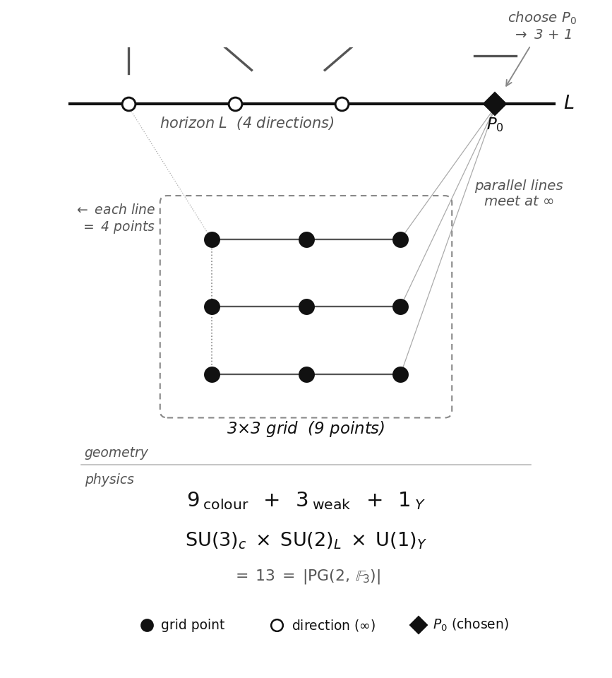

# 4. Gauge Structure from the Projective Plane

The previous chapter derived two numbers: the bound-state count of the Schrödinger equation, N = 3 (§3.3), and the spatial dimension fixed by its realisation consistency, d = 3 (§3.4). The two were derived independently — yet they take the same value, N = d = 3. In this chapter we construct, from N = 3, the three-dimensional space F₃³ over the three-element field F₃ — why "3" becomes a field, and not a mere count, and why the rank 3 comes from the three bound states (d = 3 is not an input), is shown in §4.1. This chapter shows that the geometric structure arising from it has the same mathematical construction as the Standard Model gauge structure.

## 4.1. Origin of the Gauge Structure

What gauge structure arises from N = 3? The key is degeneracy. Within this construction, a continuous internal rotation symmetry is carried by degeneracy — directions with the same internal energy.

On the Standard-Model side, quark colour (red, green, blue) is the archetype: every colour has the same energy, so the continuous rotation symmetry SU(3) stands. On the derived side, the generations — the three bound states of V = −H — all have distinct energies (E₀ ≠ E₁ ≠ E₂, by the Sturm-Liouville theorem), so a preferred eigenbasis exists. The symmetry preserving this basis is discrete and cannot support a continuous gauge group.[^gencas] The gauge directions therefore cannot arise from the interchange of generations — they must come from the geometry of the space F₃³, which we now construct.

[^gencas]: The contact index b = 8/3 in the mass formula of §7.1 is derived from the finite incidence geometry and is compatible with this (its numerical agreement with the SU(3) Casimir is an N = 3-only consistency check, §7.1).

$$N = 3 \xrightarrow{\text{generation cycling}} C_3 \xrightarrow{\;\mathrm{End}\;} \mathbb{F}_3 \xrightarrow{\text{free module}} \mathbb{F}_3^3 \xrightarrow{\text{projectivisation}} \mathrm{PG}(2,\mathbb{F}_3)\;(13\text{ points}) \xrightarrow{\;\text{flag}\;} 9{+}3{+}1$$

From N = 3, the three-dimensional space F₃³ over the field F₃ = {0, 1, 2} is determined. The origin of the field structure lies in the exchange of generations. The cyclic shifts of the three bound states (1→2→3→1 and its iterates) form C₃, the unique non-trivial proper normal subgroup of S₃, and carry any state to any other by exactly one shift. The maps preserving the composition of shifts are only three — multiplication by 0, by 1, and by 2 (the endomorphism ring) — and they form the field F₃ = ℤ/3ℤ with its addition and multiplication: here 3 becomes a field, not merely a count.

$$C_3 = \{e,\ c,\ c^2\},\qquad \mathrm{End}(C_3) = \{\,c \mapsto c^k : k = 0, 1, 2\,\} \cong \mathbb{Z}/3\mathbb{Z} = \mathbb{F}_3$$

Assigning one basis direction to each of the three bound states and completing freely, admitting only F₃-linear combinations, gives F₃³ (the free F₃-module on the three states; |F₃³| = 3³ = 27 elements; the theorem-level construction is given in Paper II). The spatial dimension d = 3 is an independent theorem carrying the same number, not an input to the rank of F₃³; N = d = 3 remains a coincidence of consistency. The projective construction that follows requires a field (not merely a group); since N = 3 is prime, F₃ = ℤ/3ℤ is the unique field with N elements — indeed, the additive group of a three-element field has order 3, so it coincides with ℤ/3ℤ generated by 1, and multiplication is then determined from addition by distributivity, making the operation tables unique.

Removing the origin and taking a two-dimensional cross-section gives F₃² = {0,1,2} × {0,1,2} — a 3×3 grid. These 9 points are the starting point for the construction.

Drawing lines on the 3×3 grid, lines with the same slope are parallel and do not intersect. In projective geometry, parallel lines meet at a single "point at infinity" — the same principle by which parallel railway tracks converge to a point on the horizon in perspective drawing. The lines on F₃² have |F₃| + 1 = 4 slopes (0, 1, 2, ∞ — horizontal, right-diagonal, left-diagonal, vertical), each generating one point at infinity. These four points form the "line at infinity" L — the horizon.

Adding the 4 points at infinity to the original 9 gives 9 + 4 = 13 points. This is the projective plane PG(2, F₃) — the space obtained by defining "points" as one-dimensional subspaces and "lines" as two-dimensional subspaces through the origin of F₃³, with a symmetric structure of 13 points, 13 lines, 4 points per line, and 4 lines through each point (Figure 2).

$$|\mathrm{PG}(2,\mathbb{F}_3)| = \frac{3^3 - 1}{3 - 1} = 13$$

*Figure 2. The structure of the projective plane PG(2, F₃). Parallel lines on the 3×3 grid (9 points, filled circles) meet at directions on the line at infinity L (open circles). Choosing P₀ (filled diamond) produces the partition 9+3+1 = 13, corresponding to the sector structure of SU(3)×SU(2)×U(1).*

Under the full symmetry PGL(3, F₃) of PG(2, F₃), all 13 points are equivalent and no partition arises. We now fix one of the 4 points on the line at infinity L as a reference point P₀ — the pair (P₀, L) is called a flag. Fixing the flag is a choice of reference within the construction: PGL(3, F₃) acts transitively on flags, so every choice yields an isomorphic partition. The fixing splits the 13 points into three orbits that do not mix under the transformations preserving the flag: 9 points off L (the 3×3 grid), 3 points on L excluding P₀, and P₀ itself. Choosing P₀ alone gives only two groups, 1+12; choosing a flag produces 9+3+1. This is the minimal structure distinguishing three forces:

$$N^2_{(9\;\mathrm{colour})} + N_{(3\;\mathrm{weak})} + 1_{(1\;\mathrm{hyp})} = N^2 + N + 1.$$

N = d is satisfied only by N = 3 (N = 2, 4, 5 all have d = 3 ≠ N) — a coincidence of consistency, not an input. All numbers in the partition 9+3+1 are determined by N alone: N² = 9, N + 1 = 4 (excluding the reference point gives N = 3), reference point 1. Total: N² + N + 1 = 13. The 52 flags (point-line incidence pairs) provide the basis for the Laplacian (§5.3).

## 4.2. From 13 Points to the Standard Model Gauge Group

The partition 9+3+1 has the same form as the sector structure of the Standard Model gauge group SU(3)×SU(2)×U(1)_Y. Here we hypothesise that the three blocks of this partition are the gauge sectors of the Standard Model. At this stage this is a provisional identification; but the coupling constants (§5) and the mixing angles (§8) are derived from it and agree with experiment, which corroborates the identification.

**9 points → SU(3).** The 9 off-line points constitute the affine plane AG(2, F₃). These 9 points are labelled by (a,b) ∈ F₃² and naturally index the finite Weyl operators W_{a,b} = XᵃZᵇ in the three-dimensional internal representation. The identity W_{0,0} is the central component; the remaining 8 non-trivial Weyl components form the traceless sector. By the Killing-Cartan classification, the unique rank-2, dimension-8 compact simple Lie completion is su(3). The 9th, central component corresponds to the global baryon number U(1)_B (an ungauged global charge; the exact anomaly-free combination is B−L, §8.3).

**3 points → SU(2).** The 3 points on L excluding P₀ give three non-trivial weak directions relative to the reference point. The minimal non-abelian compact Lie completion of these three directions is the 3-generator su(2), whose doublet representation gives the weak SU(2) action.

**1 point → U(1)_Y.** The reference point P₀ gives the abelian central module phase, and physically corresponds to hypercharge U(1)_Y.

**Direct product guarantee.** Translations of the affine plane fix the line at infinity L — shifting the grid does not change the "directions." The colour sector (9 points) transformations do not mix with the electroweak sector (3+1 points). This is a geometric property following from the incidence structure of PG(2, F₃): it yields a direct-product structure of three mutually non-mixing sectors — the same shape as the Standard-Model gauge group. The global form of the group (in the Standard Model, including the Z₆ quotient [38]) is not fixed by the geometry alone; it is determined by the faithful action on the particle carrier^II^.

$$n^2{=}n \xrightarrow{V=-H} N{=}3 \xrightarrow{\text{free module}} \mathbb{F}_3^3 \xrightarrow{\text{count directions}} 13\text{ points} \xrightarrow{\text{flag}} 9{+}3{+}1 \xrightarrow{\text{Killing-Cartan}} \mathfrak{su}(3)\oplus\mathfrak{su}(2)\oplus\mathfrak{u}(1).$$

This mathematical result agrees with the experimentally established gauge structure SU(3)×SU(2)×U(1).

The 4 on-line points correspond to the four real degrees of freedom of the SU(2) doublet — the three Goldstone bosons required for SU(2)×U(1) → U(1)_em breaking and the physical Higgs. V = −H takes its minimum −ln 2 at φ = 0 (σ = 1/2) and returns to zero as φ → ±∞ — a stable well (V''(0) = 1/4 > 0). The vacuum sits at the interior point σ = 1/2 rather than at the vanishing-field points σ ∈ {0,1} — the role played in the Standard Model by the negative quadratic term (μ² > 0), moving the vacuum from the symmetric point to a finite field value, is here played by the shape of the well.

## 4.3. Origin of Fermion Diversity

§4.2 established that the 13 directions of PG(2, F₃) give a structure with the same shape as the Standard-Model gauge group. But the 13 directions do not correspond to fermions themselves. They define the gauge symmetry — the structure of forces — and the fermion structure emerges as **representations** of this gauge group. Here we show why the single existence variable n gives rise to a diverse matter-particle structure.

Before the gauge structure emerges, n has no quantum numbers — no generation label, no colour, no isospin. Without distinguishing properties, multiple instances of n are identical (Leibniz's principle of the identity of indiscernibles), and n remains unique. The gauge structure of PG(2, F₃) changes this: the representations of the gauge group create diverse "slots" — configurations — in the internal space, with each configuration carrying an occupation number n_i ∈ {0,1}. The configuration decomposition is:

$$\sum_{i} \hat{n}_i = \hat{n}, \qquad \hat{n}_i^2 = \hat{n}_i, \qquad \hat{n}_i \hat{n}_j = \delta_{ij}\,\hat{n}_i$$

The three equations are one-particle statements: the first states that existence decomposes into configurations; the second that bivalence (n² = n) is inherited by each configuration; the third that the unique unit of existence occupies exactly one configuration. Taken together, the n̂ᵢ are mutually orthogonal projections summing to n̂ — the orthogonal resolution of the one-particle state space.

The Pauli exclusion principle itself — no double occupancy of a single mode, together with exchange antisymmetry — is carried by the many-body realisation (the CAR construction; CAR = canonical anticommutation relations)^II^, with each configuration as a mode. In the many-body realisation distinct configurations can be simultaneously occupied, but the occupation of each mode is restricted to {0,1} — this is the occupation-number representation of the Pauli exclusion principle [11]. Note that n_i = 0 does not mean non-existence (the σ = 0 forbidden by A3); it only means existence occupies a different configuration.

Each configuration i is characterised by two labels — generation k (which bound state of V = −H) and gauge representation α (which sector of PG(2, F₃)):

$$n_i = n_{k,\alpha},\qquad k = 1, 2, 3$$

The representations of SU(3)×SU(2)×U(1) give 16 states per generation — 48 configurations across the three generations (table below).

The chiral asymmetry (SU(2) acting only on left-handed fields) is part of this particle-species specification and is not derived in this paper. In Paper II, under the stated enumeration conditions, mixed configurations are excluded and the left/right assignment is unique up to a global orientation convention. The hypercharge values in the table below are the unique anomaly-free assignments compatible with the 9+3+1 sector structure, Yukawa closure, the inclusion of ν_R, and the specification of a single local abelian gauge factor (B−L remains an ungauged global charge, §4.2); the operator-level derivation is likewise given in Paper II:

| Representation | Content | States |
|---|---|---|
| (3, 2, 1/6) | Left-handed quarks Q_L | 6 |
| (3, 1, 2/3) | Right-handed up-type u_R | 3 |
| (3, 1, −1/3) | Right-handed down-type d_R | 3 |
| (1, 2, −1/2) | Left-handed leptons L_L | 2 |
| (1, 1, −1) | Right-handed charged lepton e_R | 1 |
| (1, 1, 0) | Right-handed neutrino ν_R | 1 |

Total: 16 × 3 generations = 48 configurations (counted as Weyl components, antiparticles not included, ν_R included). The inclusion of ν_R is required for Yukawa closure and for the B−L-protected Dirac-neutrino structure (see §8.3 of this paper). The generators of SU(3)×SU(2)×U(1) correspond to 8+3+1 = 12 gauge bosons (8 gluons, 3 weak bosons W⁺W⁻Z, 1 photon). Together with the Higgs boson from §4.2, the 48 fermions, 12 gauge bosons, and 1 Higgs constitute the complete particle content of the Standard Model.

Thus, diverse matter (n_i) arises from unique existence (n) — the diversity of matter is a consequence of gauge structure.

The internal consistency of this construction is independently confirmed by the eigenfunction participation ratio

$$D_{PR} = \frac{(\int \rho\, d\varphi)^2}{\int \rho^2\, d\varphi} = 13.06 \approx |\mathrm{PG}| = 13,\qquad \rho = \sum_n \psi_n^2$$

with ρ the total density of the three bound states (reproduced by the accompanying verification code), and by the spectral decomposition of the 52×52 flag Laplacian.[^flagspec] No step in the derivation contains a free parameter. The validity of this construction is supported by the fact that all independent physical quantities derived in §5–§10 agree with experiment to 0.0006%–2.6% accuracy.

[^flagspec]: The finite-kernel theorem and its spectral gauge-decomposition corollary in Paper II.
